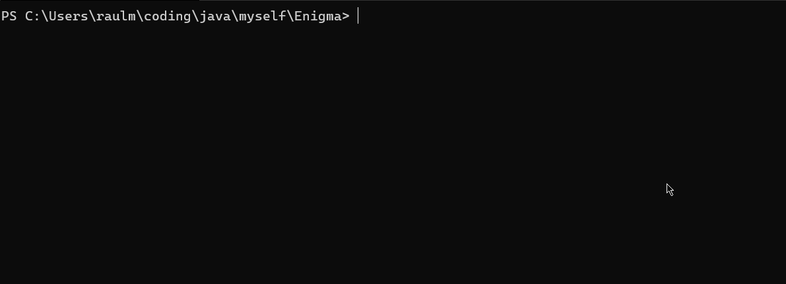

# Enigma


<p align="center">
  A simple encryption machine built with Java
 </p>
 
## About
This Java file is an encrytion and decryption machine. It uses the an encrytion method similar to the Caesar cipher except due the fact that Enigma uses all the ASCII table instead of the latin alphabet. You can use the machine through prompt params or using a .txt file as input and output.

## Install
Make sure you are running a JRE (8 or higher) in your machine.
```
git clone https://github.com/raulmel1o/Enigma.git
```

## Usage
Enigma can handle 5 params: **-mode**, **-key**, **-data**, **-in**, **-out**.
There params can be used in any order.
If the param in not declared the default value will be used.
If both **-in** and **-data** are declared, **-in** will be used as input.

### -mode
Recieves an string.
The default mode is "enc".

* **"enc"** selects the "Encryption" mode.
* **"dec"** selects the "Decryption" mode.

#### Encrypting
```
java Enigma.java -mode enc
```

#### Decrypting
```
java Enigma.java -mode dec
```

### -key
Recieves an integer, this key is needed to decrypt the message.
The default value is 0.

```
java Enigma.java -key 12
```

### -data
Recieves a String, this is the message to be encrypted.
The default value is "";

```
java Enigma.java -data Hello World
```

### -in
Recieves a String, it is the path of the .txt file which contains the input message.
If the file does not exists the program will return: "An exception was found: _pathfile_".

```
java Enigma.java -in C:\Users\user\file.txt
```

### -out
Recieves a String, it is the path of the .txt file which contains the input message.
If it is blank the output will be printed in the terminal.
**If the file exists it will be overwritten, if the file does not exists it will be created.**

```
java Enigma.java -out C:\Users\user\file.txt
```
